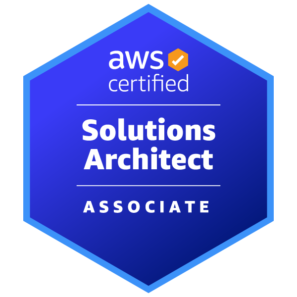

> 初出: 2024年12月15日(旧ブログの記事を移行・加筆)

PHPerとして働きながらAWS認定ソリューションアーキテクト アソシエイト（SAA-C03）に合格しました。本記事では、勉強法と受験して得られた知識をまとめます。バックエンド中心のエンジニアでAWS資格に挑戦したい方に向けた内容です。

## 結論：サーバー構築経験があれば短期間で合格できる

* ネットワーク、DNS、Linuxの基礎があれば、AWSの各サービスを学ぶだけで合格できます。
* サーバー構築の経験者であれば、問題集を3日ほどやり込めば取得も狙えると考えています。
* 経験がない方は、試験対策の一環としてLAMP環境を一度構築することをおすすめします。

ここでの基礎知識は深い知見ではなく、「DNSはドメインを管理するサービス」と説明できる程度で十分です。

## SAA-C03とは

AWS Certified Solutions Architect – Associate は、4段階ある AWS 認定資格の下から2番目に位置する中級資格です。コストとパフォーマンスが最適化されたソリューションの設計に重点を置いています。

| 項目 | 内容 |
| --- | --- |
| カテゴリ | Associate |
| 試験時間 | 130分 |
| 試験形式 | 65問（複数選択または複数応答） |
| コスト | 150 USD |
| 受験オプション | Pearson VUE テストセンターまたはオンライン監督付き試験 |

詳細は[公式ページ](https://aws.amazon.com/jp/certification/certified-solutions-architect-associate/)を参照してください。

## 受験者の経歴

* 基本的にバックエンドを担当するアプリケーションプログラマー
* たまにサーバーの構築・保守も担当
* AWS歴は3年（業務での経験は浅め）
* 受験前に触ったサービスはLAMPに関わるものが中心
  * EC2
  * ALB
  * ECS
  * Lambda
  * RDS
  * S3
  * CloudWatch
  * SQS
  * SES

## 勉強法

### Ping-t

[Ping-t](https://mondai.ping-t.com/)を中心に学習しました。

* 1問1答形式で、分からない点を解消しながらサービスの理解を深められます。
* サービスごとの問題集と、試験レベルの問題が用意されています。
* SAAに関しては無料で利用できます。

### AWS Black Belt

問題を解くだけでは学びが薄いと感じたため、業務に関わりそうなサービスは[AWS Black Belt](https://aws.amazon.com/jp/events/aws-event-resource/archive/)でも学習しました。

* EC2 + Auto Scaling
* RDS / Aurora
* DynamoDB
* ElastiCache
* S3 / EFS
* SQS / SNS

試験範囲すべてのBlack Beltを読むのが理想ですが、時間が確保できず、業務に関わるサービスに絞りました。ただ、**業務に活かす観点では、問題集よりも公式資料を読み込むほうが有意義でした。**

### 学習期間

合計で約3週間です。

* 7日間：Black Belt
* 14日間：Ping-t

子育ての合間に学習したため時間がかかりました。前述のとおり、サーバー構築経験者ならもっと短縮できます。

## 取得してAWSの業務をこなせるようになるか

結論は **No** です。

* 合格するとAWSの各サービスへの理解は深まります。
* ただし、業務にすぐ活きるわけではありません。
* 既存のインフラ構成がベストプラクティスに反していると分かっても、構成に至った経緯を踏まえて判断する必要があります。

## 受験で得られた知識

業務に活きそうな知識は次のとおりです。

* Lambda
  * コールドスタート対策
  * イベント駆動での活用（SNS / SQS）
  * VPC内への配置
* S3 / EFS
  * コスト削減戦略
  * アップロードの最適化
  * Putイベント
* RDS / Aurora
  * マルチリージョン
  * RDS Proxy
* ALB / NLB
  * パフォーマンス最適化
  * マルチリージョン
* VPCのネットワーク
  * ピアリング
  * マルチリージョン
  * オンプレミスとの通信
* オンプレミスとクラウドのハイブリッド戦略
  * ストレージ間の同期（データ転送量を考慮した構成・サービス）
  * アプリケーションはオンプレミス、データ基盤はクラウド
  * データセンターへのクラウド基盤の提供

学習中に出会った、目からウロコの知見もあります。

* DBインスタンスは、セキュリティグループを絞る前提でパブリックサブネットに置く選択肢もあるのではないか
* SSH鍵を不要にする戦略

## PHPerとしての次のステップ

* 上位資格のSAP（Professional）は、AWSに深く関わるタイミングで挑戦する予定です。
* 当面は、PHPに直接関わる領域とDevOpsの知見を深めたいと考えています。

### MySQL

* Materialized View
* Window関数、JSONの扱い
* パフォーマンスチューニング

### nginx

* セキュリティに関わるHTTPヘッダー
* プロセス管理

### DevOps

* CI/CD（GitHub Actions）
* IaC（Terraform）

## まとめ

* SAA-C03は、基礎知識があれば誰でも合格を狙える資格です。
* 問題集（Ping-t）で合格力を、公式資料（Black Belt）で実務に活きる理解を得られます。
* 資格取得は業務の即戦力化には直結しませんが、AWSサービスを体系的に理解する良い機会になります。
