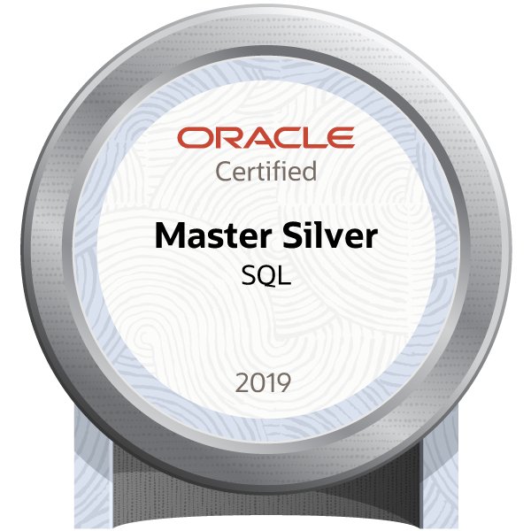

> 初出: 2022年2月3日(旧ブログの記事を移行・加筆)

ORACLE MASTER Silver SQL 2019に合格しました。本記事では、取得メリットと勉強法をまとめます。実務経験が浅いエンジニアや、未経験からIT業界を目指す方に向けた内容です。

## 結論：経験の浅いエンジニアにおすすめの資格

* 基礎がある方が本気で取り組めば、1か月ほどで取得できます。
* 「書く技術」「環境構築」「書籍の読み込み」の順で学ぶと、資格だけで終わらない実践的なSQL力が身につきます。

## 試験の概要

* 試験：1Z0-071-JPN Oracle Database SQL
* 受験料：32,340円（税込、2021年8月時点）
* 出題形式：選択問題
* 試験時間：120分
* 出題数：78問
* 合格ライン：63%（2021年8月時点）

出題範囲は、関数、権限、オブジェクトなど、Oracle Databaseの基本操作です。学習方法は、[黒本著者によるORACLE MASTER Silver SQL 2019学習方法](https://cosol.jp/techdb/2021/08/how_to_get_oracle_master_silver_sql_2019/)も参考になります。

## 取得のメリット

実感したメリットは次の2つです。

* 求人サイトのスカウトメールの増加
* 社内での評価向上

### スカウトメールが増える

ORACLE MASTERはIT資格の中でも権威性があり、企業に分かりやすくアピールできます。

* PaizaやGreenなどのスカウトサービスで、履歴書に記載しただけでスカウトが増えました。
* IT業界の経歴が7か月（2022年2月時点）でも、「年収370万円〜」「フルリモート」といった求人が届きました。
* 当時の手取りは月18万円（年収換算で約200万円）だったため、大きな励みになりました。

### 社内での評価が上がる

* 未経験で転職した当時、自分は社内で最も仕事ができない社員という扱いでした。
* 取得を報告すると、努力を高く評価してもらえました。
* SQLを扱う業務を任される機会が増え、1年目の目標である「SQLの習得」に近づきました。

## 受験時の状況

### 経験

* 実務経験：研修1か月半＋実務6か月
* 経験業務：画面レイアウト作成、モック作成（HTML、CSS）
* SQLの業務経験
  * テーブル作成（約100本）
  * テーブル間のデータ移行と単体テスト
  * バッチ処理作成（PL/SQL）と単体テスト

SQLを扱う業務は約2か月でした。上流工程には関わらず、SELECTやINSERTなどの基本構文が中心でした。

### 勉強時間

* 期間は約2か月です。
* 本気で取り組んだのは、そのうち1か月です。

## 勉強法

次の順で進めることをおすすめします。

1. SQLの構文理解
2. 環境構築
3. 書籍の読み込み

書籍だけでも合格できますが、資格を取っただけの人にならないために、手を動かす学習を先に行います。

### 1. SQLの構文理解

SQLでデータを扱う「書く技術」は、無料サイトの[SQLZOO](https://sqlzoo.net/wiki/SQL_Tutorial)で身につけました。

* 事前にデータが用意されています。
* 抽出条件が示された問題を解く、SELECT文の問題集です。
* すべて解き終えると、結合やグループ化の記述を理解できます。

### 2. Oracleの環境構築

自分のPCにOracleをインストールすることを強くおすすめします。

* マルチテナントの概念を理解できます。
* ユーザー作成と権限付与を体験できます。これらは試験範囲です。
* 環境構築が面倒な場合は、構築不要でSQLを実行できる「Live SQL」も利用できます。

### 3. 書籍の読み込み

使用した書籍は『オラクルマスター教科書 Silver SQL Oracle Database SQL』です。

https://www.amazon.co.jp/dp/4798172367

選んだ理由は次のとおりです。

* 分かりやすい
* Oracleの機能紹介が充実している
* 各章に練習問題がある
* 模擬試験が付いている

この1冊で合格できます。MySQLしか触ったことがなくても、読み終える頃にはOracleの機能をある程度理解できました。

学習の進め方は次のとおりです。

* まず全体に一度目を通します。
* 難しいと感じた機能は、理解できるまで読み込みます。
* オブジェクトの作成や権限付与は、実際に手を動かして確認します。

難しいと感じた機能は次の3つです。

* 外部表
* データディクショナリ
* システム権限とオブジェクト権限

## まとめ

* ORACLE MASTER Silver SQL 2019は、経験の浅いエンジニアや未経験者におすすめの資格です。
* 構文理解、環境構築、書籍の順で学ぶと、実務で使えるSQL力が身につきます。
* 受験料が高く難易度もありますが、スカウトの増加や社内評価の向上といったメリットがあります。
* 今後は、この資格と相性の良いJavaやクラウドの技術を身につけていく予定です。
