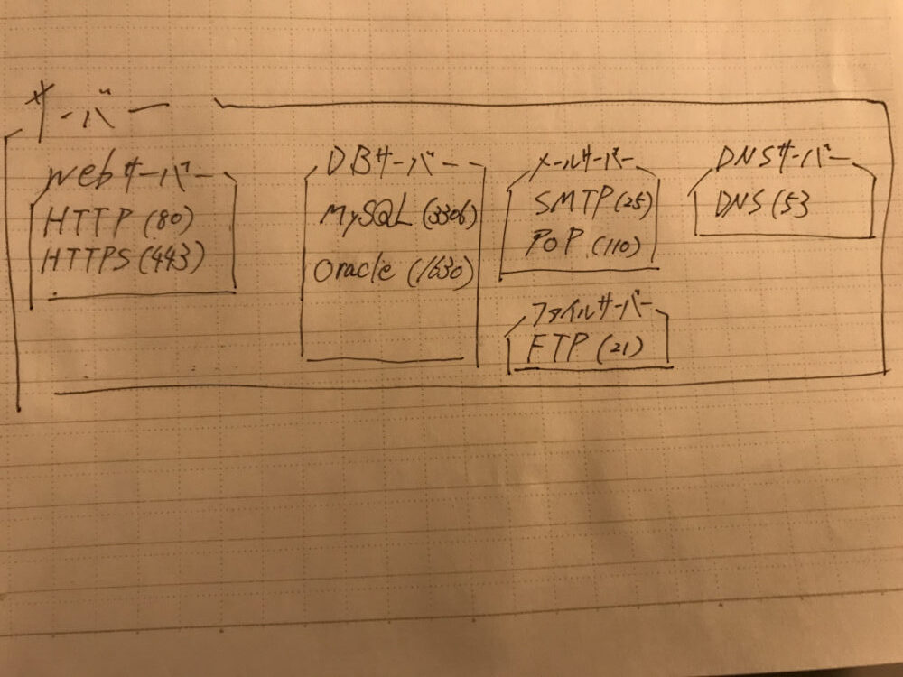

> 初出: 2021年9月25日(旧ブログの記事を移行・加筆)

サーバーとポート番号の基本を、初心者向けにまとめました。
ポート番号とIPアドレスの違いが分からなかった方や、これからエンジニアになる方に向けた内容です。

## 結論

* サーバーは、何らかの**サービスを提供する機能**です。
* ポート番号は、「何のサーバー(サービス)を利用するか」を識別する番号です。
* IPアドレスは、「ネットワークにつながっている端末」を識別する番号です。

## サーバーとは

サーバー(Server)は、Service(サービス)という言葉から想像できるように、何らかのサービスを提供する機能です。
アプリを使うユーザーから要求があれば、それを満たすプログラムやデータを渡すのが、サーバーの仕事というイメージで大丈夫です。

### サーバーは種類がたくさんある

サーバーは、高度な処理をしているので、目的に合ったものを用意する必要があります。

* Webとの通信をしたいなら、Webサーバー
* DBを使いたいなら、データベースサーバー
* メールを送受信したいなら、メールサーバー

これらは代表的なものです。ほかにも、機能ごとにさまざまなサーバーがあります。

### 主なサーバーとポート番号

| サーバー | 用途(プロトコル) | ポート番号 |
| --- | --- | --- |
| Webサーバー | HTTP | 80 |
| Webサーバー | HTTPS | 443 |
| データベースサーバー | MySQL | 3306 |
| データベースサーバー | Oracle | 1521 |
| メールサーバー | SMTP | 25 |
| メールサーバー | POP3 | 110 |
| DNSサーバー | DNS | 53 |
| ファイルサーバー | FTP | 21 |

サーバーの種類とポート番号を、手書きでまとめたメモです。



:::message
メモには Oracle を「1630」と書いていますが、正しいデフォルトのポート番号は **1521** です。
:::

## ポート番号

サーバーを使うときは、ポート番号という、固有の番号を指定します。
ポート番号を一言で言うと、**各サーバー(サービス)に割り当てられている番号**です。
「使いたいサーバーの別名がポート番号」と考えて問題ありません。

ローカル環境でアプリを作ったことがある方は、次のURLを見たことがあるかもしれません。
この `8888` の部分が、ポート番号です。
(本来のWebサーバーのポート番号は `80` ですが、個人的な理由で `8888` に変更しています。)

```
http://localhost:8888/~~
```

### ポート番号とIPアドレスの違い

私は、ポート番号とIPアドレスの役割の違いが分からず、理解に苦労しました。
図を書いてみて、納得できました。

* **ポート番号**: 何のサーバー(サービス)を使うかを識別するための番号です。
* **IPアドレス**: インターネットにつながっている端末を識別するための番号です。

建物にたとえると、IPアドレスが「住所(ビル)」で、ポート番号が「部屋番号」です。

## サーバーサイドエンジニアの語源

サーバーサイドエンジニアとは、サーバー側でプログラムを扱うエンジニアのことです。
反対に、画面側でプログラムを扱うエンジニアを、フロントエンドエンジニアと呼びます。
サーバーサイドエンジニアとバックエンドエンジニアは、ほとんど同じだと考えて大丈夫です。

## まとめ

* サーバーは、サービスを提供する機能で、目的に合わせて種類があります。
* ポート番号は、利用するサービスを識別します。
* IPアドレスは端末を、ポート番号はその端末上のサービスを識別します。
