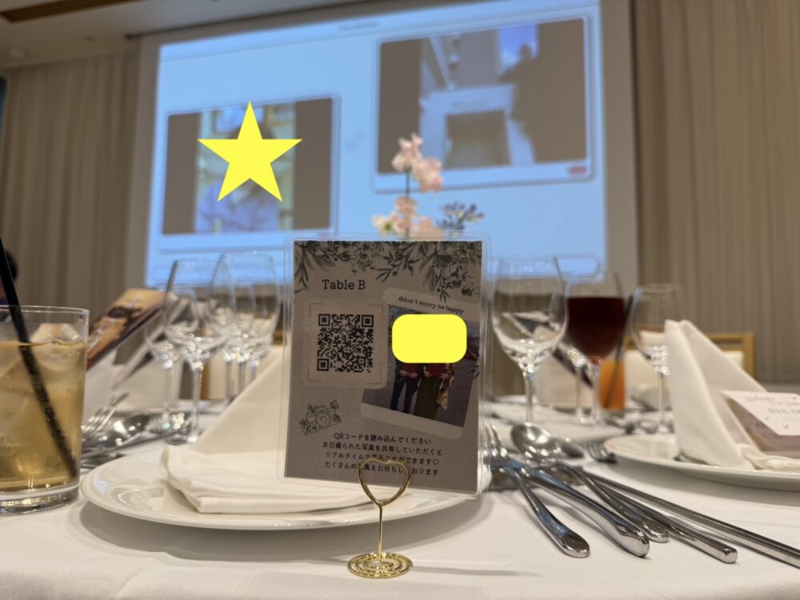

> 初出: 2026年3月18日(旧ブログの記事を移行・加筆)

結婚式で使う写真共有Webアプリを、AWSのサーバーレス構成で自作した話をまとめました。
低コストなサーバーレス構成や、署名付きURLを使ったアップロードの設計に興味がある方に向けた内容です。

リポジトリ: https://github.com/HrOkiG2/wedding-memory-sns

## 結論

テーブルに置く「写ルンです」の代わりに、**QRコードから写真を投稿して、会場のスクリーンにリアルタイムで映すWebアプリ**を作りました。
AWS利用料は、開発期間を含めても数百円で、**約3.5万円を節約**できました。

## 何を作ったの?

結婚式でよくある、卓に置くインスタントカメラ(写ルンです)の代わりに、リアルタイムで式の様子を共有するWebアプリです。
QRコードと、会場のスクリーンを使って、式の様子を共有します。

実際の会場の様子です。テーブルのQRコードから投稿した写真が、奥のスクリーンに映ります。



## なぜ自作したのか

シンプルに、お金がなかったからです。

自分の結婚式で、ゲストが写真を撮って楽しめる演出として、各テーブルに写ルンですを置くことを考えていました。
ですが、本体代に加えて、現像・データ化の費用を含めると、想定以上のコストでした。

* 本体代: 2,000円 × 卓数
* 現像代: 950円 × 卓数
* データ化: 900円 × 卓数

ゲストの卓数が15だったので、次のコストがかかります。

```
(2,000 × 15) + (950 × 15) + (900 × 15) = 57,750円
```

結婚式の費用だけでも、大きな金額がかかっているので、不要な出費は痛く、写ルンですを配置する企画自体を、取りやめようと考えました。

そこで、妻から「あなたエンジニアなんだから、どうにかならないの?」と言われ、「それもそうだ、自分で作ろう」と思い立って、写真共有Webアプリを開発しました。

## システム概要

仕組みはシンプルです。

1. 各テーブルに**QRコード**を設置します。
2. ゲストがスマホでスキャンすると、ブラウザのアプリが起動します(ログイン不要)。
3. 撮った写真をアップロードすると、会場の**スクリーンにリアルタイムで反映**されます。

## 技術構成

開発期間は、仕事の合間を縫って、約2週間でした。
「**維持費を極限まで下げる**(サーバーレス)」ことと、「**TypeScriptで統一する**」ことを、テーマにしました。

### フロントエンド

* **Framework**: Nuxt 3(Vue 3)
* **Language**: TypeScript
* **Styling**: Tailwind CSS
* **Hosting**: S3 + CloudFront(静的サイト)

### バックエンド・インフラ(AWS CDK)

インフラは、すべて**AWS CDK**でコード管理しています。

| サービス | 用途 |
| --- | --- |
| CloudFront | CDN、HTTPS終端、APIへのプロキシ |
| S3 | フロントエンドのホスティング、写真ストレージ |
| API Gateway | HTTP API(REST) |
| Lambda | Node.js 20(ARM64)で実装。認証と、署名付きURLの発行を担当 |
| DynamoDB | ゲストの認証情報、写真のメタデータ、レートリミットの管理 |

## こだわった技術ポイントと「ハマりどころ」

単純なアップローダーに見えますが、**「不特定多数のゲストが」「多様な端末で」「一斉に使う」**という環境特有の課題がありました。

### 署名付きURL(Presigned URL)の活用

Lambda経由で画像をアップロードすると、ペイロードサイズの制限(6MB)や、実行時間に対する課金の問題が出ます。
そこで、クライアントから「アップロードしたい」とリクエストがあったときに、Lambdaが**S3への一時的な書き込み許可証(Presigned URL)**を発行して、クライアントがS3に直接アップロードする構成にしました。
これで、サーバーの負荷を最小限に抑えられます。

### iPhoneの「コードスキャナー」

これが、開発中の最大の落とし穴でした。

iPhoneのコントロールセンターにある「コードスキャナー」でQRを読むと、Safariではなく、**一時的なアプリ内ブラウザ**で開かれます。
このブラウザは、**画面を閉じるとCookieやLocal Storageが、すぐに破棄される**ため、「さっきアップした写真を確認しよう」と再度QRを読み込むと、ログアウト状態になってしまいます。

技術的に、「強制的にSafariを開かせる」方法はありません。
そこで、「**iPhoneの方は、標準のカメラアプリで読み取ってください**」という物理的なPOPを、各卓に置くという、アナログな解決策に落ち着きました。

## やらなかったこと

あえて、アップロードされた画像の**ダウンロード機能は実装しませんでした**。

妻と相談した結果ですが、アップロードされた画像は、一度、私たち夫婦のもとに保存して、それをLINEなどで発信したいと考えたからです。
その過程で、結婚式の思い出に、もう一度触れたいという思いがありました。

結果として、LINEで、参列者の友人たちと、結婚式の思い出に浸ることもできました。
また、機能を減らしたことで、実装コストが下がったのも大きかったです。

## コスト比較の結果

AWSの利用料は、開発期間を含めても、数百円でした。当日のスパイクアクセス(CloudFront、Lambda、S3)も、微々たるものでした。
**約3.5万円の節約**に成功して、その分を、料理や引き出物のグレードアップに回せました。

## 参列者の反応

結果は、**大成功**でした。

* **リアルタイム性**: 投稿した写真がすぐスクリーンに出るので、「いまの面白い瞬間」が共有されて、会場の一体感が生まれました。
* **懐かしさの共有**: 新郎新婦との昔の写真を、スマホから掘り出して投稿してくれるゲストが多く、スライドショーがエモい雰囲気になりました。
* **交流**: ゲスト同士で、「いまの写真送って!」ではなく、「QRから上げといて!」という会話が生まれて、自然な交流のきっかけになりました。

副次的な成果として、参列していた友人2人から、「自分の式でも、これを使わせてほしい」とオファーをもらいました。(すごく嬉しかったです。)

アップロードされた画像は、約300枚になり、予定していた100枚よりも、大幅に多くなりました。
余興の多い沖縄の結婚式のなかで、これだけ多くの画像が投稿されたのは、機能を絞ったことと、UIをシンプルにしたことが、影響したのではないかと思っています。

## 今後の改善点

1. **画像配信の最適化**: いまは、S3のPresigned URLで画像を表示しているので、エッジキャッシュが効いていません。CloudFront経由の署名付きCookie/URLに切り替えて、表示速度を向上させたいです。
2. **不適切画像のAI検知**: 今回は、ゲストのモラルに助けられましたが、Amazon Rekognitionで、不適切な画像を自動で弾く機能を入れれば、より安心して運用できます。
3. **アクセス解析**: Microsoft Clarityなどを入れて、ゲストがどこでつまずいたか(UX)を計測すべきでした。
4. ネイティブアプリにしたら、面白そうだと思っています。(作ったことはありませんが、共同で開発してくれる方がいたら、ぜひ。)

## まとめ

「節約」から始まったプロジェクトでしたが、結果として、**写ルンですでは出せない、リアルタイムな体験価値**を提供できました。
なにより、自分の技術で、一生に一度のイベントを盛り上げられた達成感は、何にも代えがたいものでした。

これから結婚式を挙げるエンジニアのみなさん、**「結婚式を自作Webサービスで盛り上げる」**のは、おすすめです。
